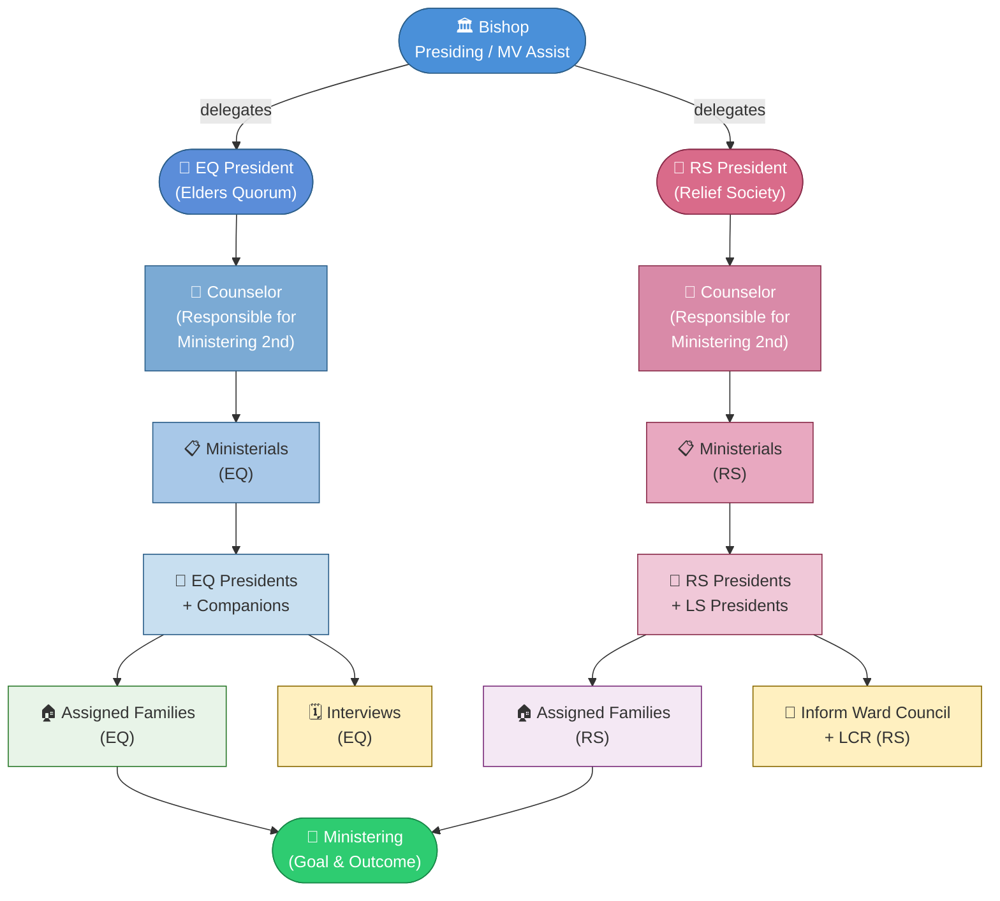
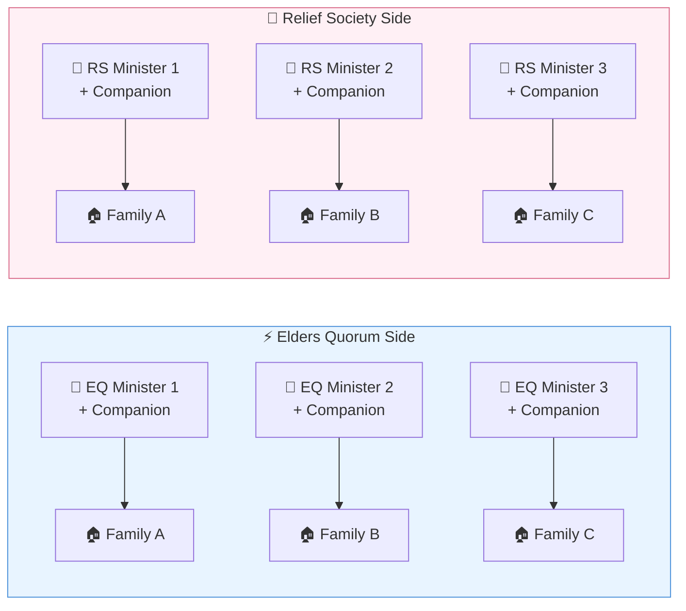

# General Handbook — Ministering Structure
### Harare Zimbabwe South Stake — Unit Level
**Date:** 13 April 2026
**Focus:** Causes & Generations

---

## Ministering Organisation Chart

---

## Key Roles & Responsibilities

| Role | Responsibility |
|------|---------------|
| **Bishop** | Presides over the unit; delegates ministering oversight |
| **EQ President** | Oversees Elders Quorum ministering assignments |
| **RS President** | Oversees Relief Society ministering assignments |
| **Counselor (EQ)** | Directly responsible for EQ ministering coordination |
| **Counselor (RS)** | Directly responsible for RS ministering coordination |
| **Ministerials (EQ)** | Assigned ministering brothers |
| **Ministerials (RS)** | Assigned ministering sisters |
| **LS Presidents** | Assist RS Presidents; report to Ward Council + LCR |

---

## Ministering Flow

1. **Bishop** presides and assigns oversight to **EQ President** and **RS President**
2. Each president appoints a **Counselor** responsible for ministering coordination
3. Counselors manage **Ministerial assignments** (brothers/sisters with companions)
4. Each pair is given **Assigned Families** to minister to
5. **EQ** tracks progress through **interviews**; **RS** reports to **Ward Council & LCR**
6. The outcome and goal is effective **Ministering** across all assigned families

---

## Companions Model

---

*Harare Zimbabwe South Stake — General Handbook Ministering Reference*
*Date: 13 April 2026*
